# Piece previews
Installation instructions [here](https://github.com/IcefoxKishi/styles?tab=readme-ov-file#installation-instructions).
| Style | Normal | Red |
| --- | --- | --- |
| 1-Kanji | WIP |  |
| 1-Kanji, straight grain |  | NA |
| Asato, on tiger | WIP | 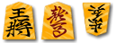 |
| Chikufū Minase, straight grain | 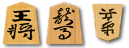| NA |
| Chikufū Ryōko, root pattern | 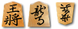 | NA |
| Chōroku, on tiger | WIP | 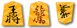 |
| Gadō, on tiger | WIP | 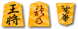 |
| Genbee-Kiyoyasu | WIP | 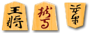 |
| Genbee-Kiyoyasu, on tiger | NA | 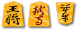 |
| Hakudō, on tiger | WIP | 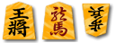 |
| Kaisho, on tiger | 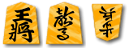 | NA |
| Kinki | WIP | 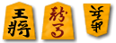 |
| Kinki, straight grain | WIP | 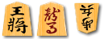 |
| Kinki, on tiger | WIP |  |
| Kiyoyasu, on tiger | WIP | 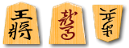 |
| Kōsai, on peacock | WIP | 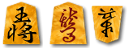 |
| Kurobori/Ryakuji | WIP |  |
| Maki-Ryōko | WIP | 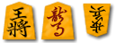 |
| Maki-Ryōko, straight grain | WIP | 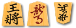 |
| Maki-Ryōko, on tiger | WIP | 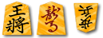 |
| Maki-Ryōko, on peacock | NA | 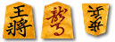 |
| Minase | WIP | 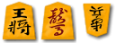 |
| Minase, straight grain | WIP |  |
| Minase, on tiger | WIP | 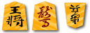 |
| Mine, on tiger | WIP | 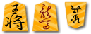 |
| Muken, on tiger | WIP | 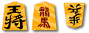 |
| Nakabori | NA | 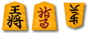 |
| Okuno Sōgyoku Kinki, on tiger | WIP | 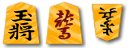 |
| Ōyama, on tiger | WIP | 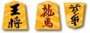 |
| Ryūji, on tiger | WIP | 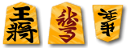 |
| Ryūkō, on tiger | WIP | 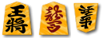 |
| Shissho/Ninju, straight grain | 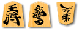 | NA |
| Shōryū, on tiger | WIP | 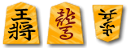 |
| Shigemine 1-Kanji |  | WIP |
| Sōho-gonomi, on tiger | WIP | 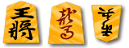 |
| Sōsho, on tiger | WIP |  |
| Tōshichisei, on tiger | WIP | 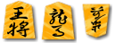 |
| Uebori | NA | 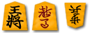 |
| Uzen 1-Kanji, on peacock | WIP |  |
| Wang Xizhi, on tiger | WIP | 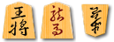 |
| Yasukiyo, on tiger | WIP | 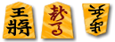 |
