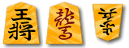

# Piece previews
| Style | Preview |
| --- | --- |
| Asato Red, on tiger |  |
| Chōroku Red, on tiger |  |
| Gadō Red, on tiger |  |
| Hakudō Red, on tiger |  |
| Kiyoyasu Red, on tiger |  |
| Kōsai Red, on peacock |  |
| Minase Red |  |
| Mine Red, on tiger |  |
| Muken Red, on tiger |  |
| Ōyama Red, on tiger |  |
| Ryūji Red, on tiger |  |
| Ryūkō Red, on tiger |  |
| Shōryū Red, on tiger |  |
| Shigemine 1-Kanji |  |
| Sōho-gonomi Red, on tiger |  |
| Sōsho Red, on tiger |  |
| Tōshichisei Red, on tiger |  |
| Uzen 1-Kanji Red, on peacock |  |
| Wang Xizhi Red, on tiger |  |
| Yasukiyo Red, on tiger |  |